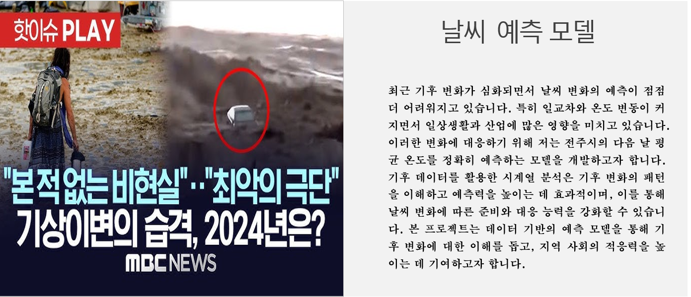
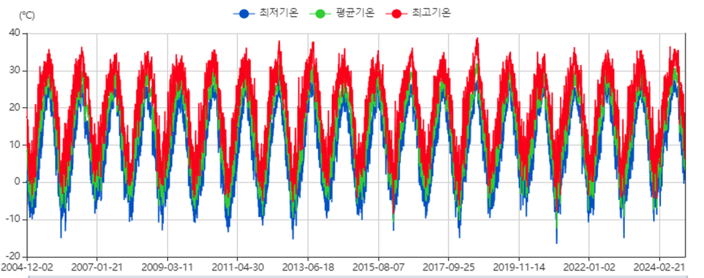
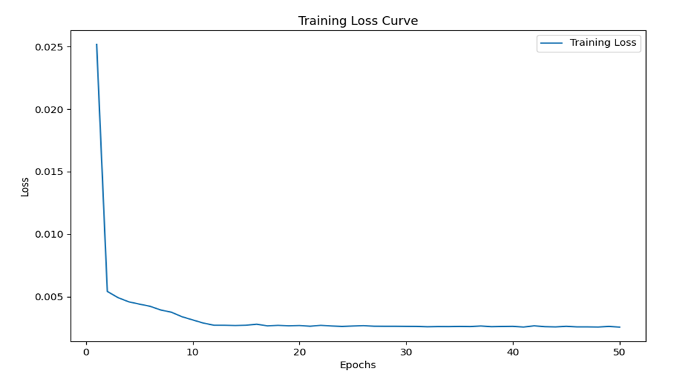
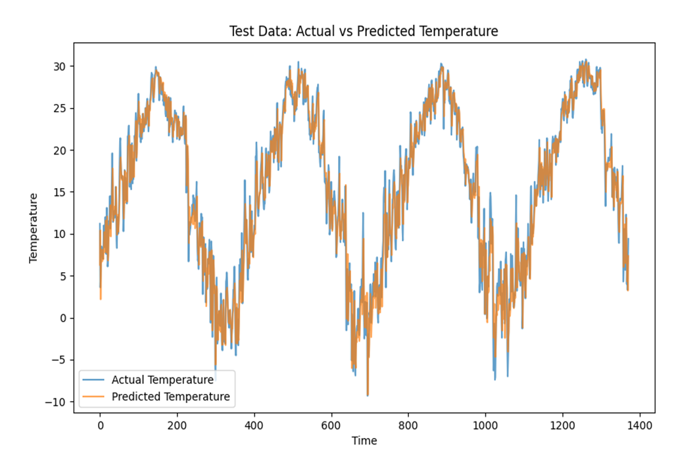

 

# 🌡️ LSTM 기반 전주시 미래 온도 예측  

> LSTM(Long Short-Term Memory) 모델을 활용하여 전주시의 미래 평균 기온을 예측하는 프로젝트입니다.  
> 데이터는 기상자료개방 포털에서 수집한 최근 20년간(2004-12-01 ~ 2024-12-01)의 일별 평균 온도를 사용했습니다.
 

## 📖 프로젝트 개요
- **주제 선정 이유**: 기후 변화에 따른 온도 예측의 필요성  
- **목표**: 다음 날 평균 온도 예측  
- **환경**: PyTorch 기반 구현, VSCode  
- **데이터 출처**: [기상자료개방포털](https://data.kma.go.kr/stcs/grnd/grndTaList.do)  
- **데이터 형태**: CSV (전주시 20년간 일별 평균기온 데이터)

 

## 📊 데이터셋
- 기간: 2004-12-01 ~ 2024-12-01  
- Feature: 일별 평균 기온  
- Target: 다음 날 평균 기온  
- 분할 비율: 학습 60% / 검증 20% / 테스트 20%  
- 범위: 최고 32.1℃, 최저 -12.4℃  
- 스케일링: Min-Max Normalization (1도 차이 = 0.02247)
  

  

 

## 🔧 모델 & 하이퍼파라미터
- **모델**: LSTM (Long Short-Term Memory)  
- **하이퍼파라미터 탐색 공간**:
  - hidden_size = [50, 100]  
  - num_layers = [1, 2, 3]  
  - seq_lengths = [15, 30, 60, 90]  
  - learning_rates = [0.001, 0.01]  
  - epochs = [30, 50]  
  - dropouts = [0.1, 0.2, 0.3]  
  - batch_sizes = [16, 32]

   
- 총 조합 수: 576

 

## 🏆 성능 평가
- **지표**: RMSE (Root Mean Squared Error)  
- **최종 Loss**: 0.0026  

  

**예측 결과 (2024-12-02):**  
- Predicted Temperature: **9.34°C**  
- Actual Temperature: **10.04°C**

  

 

## ⚙️ 기술 및 라이브러리

- Language - Python  
- Data Handling - Pandas, NumPy, itertools  
- Machine Learning - scikit-learn, PyTorch  
- Visualization - Matplotlib

 

## 📎 참고 자료
해당 README는 요약본이며, 자세한 설계 문서 및 이미지 자료는 아래 첨부 문서에서 확인 가능합니다.

- 📄 [전주시_미래_온도_구하기.pptx](./전주시_미래_온도_구하기.pptx)

